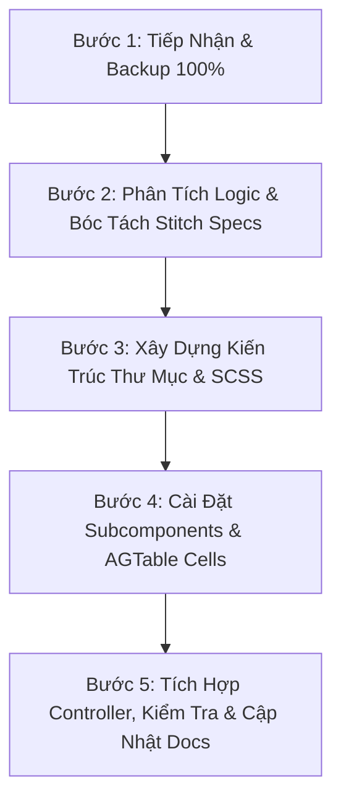

# SKILL: TỰ ĐỘNG REFACTOR GIAO DIỆN ERP THEO GOOGLE STITCH (STITCH REFACTOR ENGINE)

## 📌 MỤC TIÊU VÀ NGUYÊN TẮC VÀNG
Skill này thiết lập quy trình chuẩn hóa từng bước để tự động hiện đại hóa các màn hình ERP cũ sang phong cách **Google Stitch High-Density Enterprise**, tuân thủ 100% các bài học thực tế, quy tắc dự án và các chú ý của người dùng.

> [!IMPORTANT]
> ### 5 NGUYÊN TẮC BẮT BUỘC KHÔNG THAY ĐỔI
> 1. **BẢO TOÀN LOGIC & BACKUP ĐẦU TIÊN**: Luôn tạo bản sao lưu `[ComponentName].backup.tsx` tại cùng thư mục trước khi sửa bất kỳ dòng code nào. Không được làm mất bất kỳ state, logic nghiệp vụ hay API query nào của component cũ.
> 2. **FULL WIDTH & FULL HEIGHT TRONG CHẾ ĐỘ MULTI-TAB**: Component khi chạy trong chế độ Multi-Tab (`.component_element`) phải luôn đạt `width: 100%`, co giãn theo toàn bộ chiều rộng màn hình và kéo dài dọc không bị co bẹp (height = 0).
> 3. **AGTABLE LÀ TIÊU CHUẨN - ẨN TOOLBAR XANH LÁ CŨ**: Giữ nguyên `AGTable`, **BỎ hoàn toàn prop toolbar** và thêm SCSS `.agtable .toolbar { display: none !important; }`. Đưa các nút tải Excel (`EX1`, `EX2`) và `PIVOT` lên trên cùng thanh lọc nhanh (`gridToolbar`).
> 4. **KHÔNG DÙNG TAILWIND TRỰC TIẾP - DÙNG SCSS CHUYÊN BIỆT**: Dự án không bật Tailwind runtime. Toàn bộ giao diện phải được viết bằng SCSS trong thư mục con `Precision[ModuleName]/`.
> 5. **MODULE HÓA - KHÔNG VIẾT FILE HÀNG NGHÌN DÒNG**: Tách nhỏ các thành phần giao diện (Header, Toolbar, KPI Cards, Cells, Modals) thành các file riêng dưới 300 dòng.
> 6. **ĐẢM BẢO RESPONSIVE CHO CẢ DESKTOP & MOBILE**: Luôn code SCSS với media query để đảm bảo giao diện hiển thị tốt trên cả desktop và mobile.
> 7. **ĐẢM BẢO KHÔNG CÓ LỖI LINT, TRÁNH RUNTIME ERROR**: Nếu có lỗi lint hoặc runtime thì phải sửa ngay, không được bỏ qua.
---

## 🛠️ QUY TRÌNH 5 BƯỚC REFACTOR TỰ ĐỘNG



---

### BƯỚC 1: TIẾP NHẬN, ĐỌC FILE VÀ SAO LƯU (BACKUP)
Khi người dùng tag `@ComponentName` và cung cấp đường dẫn folder/file Stitch (`DESIGN.md`, `index.html`...):

1. **Đọc `CONTEXT.md`** ở thư mục gốc của dự án.
2. **Đọc toàn bộ file gốc** của Component được tag.
3. **Tạo ngay file sao lưu**:
   - Đường dẫn: `path/to/[ComponentName].backup.tsx`
   - Nội dung: Giữ nguyên 100% mã nguồn ban đầu của component.
4. **Đọc các file thiết kế Stitch đính kèm**:
   - `DESIGN.md`: Bảng màu (color palette), typography, spacing, layout cấu trúc.
   - `index.html` / `preview.html`: HTML mẫu và các class visual.

---

### BƯỚC 2: PHÂN TÍCH LOGIC NGHIỆP VỤ & LIỆT KÊ TÍNH NĂNG
Lập bảng ánh xạ nghiệp vụ đảm bảo không sót bất kỳ logic nào:
- **State & Props**: Các filter state, dữ liệu bảng, modal toggles, selection, flags phân quyền (`isCMS`, user role).
- **API Queries & Commands**: Các hàm `generalQuery`, `f_get...`, update/insert actions, upload files.
- **Dữ liệu cột (Columns)**: Toàn bộ field của bảng cũ, các bộ format ngày tháng, số tiền, trạng thái.
- **Chức năng đặc thù**:
  - Xuất Excel: Chuẩn hóa xuất `EX1` (dữ liệu đang lọc `filteredData`) và `EX2` (toàn bộ dữ liệu `allData`).
  - Phân tích Pivot: Mở modal DevExtreme/Custom Pivot tương ứng.
  - Các thao tác nhanh: Điểm danh tất cả, phê duyệt nhanh, đổi trạng thái hàng loạt.

---

### BƯỚC 3: XÂY DỰNG KIẾN TRÚC MODULAR & HỆ THỐNG SCSS

Tạo thư mục con tại cùng vị trí component:
```text
src/pages/.../
├── [ComponentName].tsx                  <-- Controller chính
├── [ComponentName].backup.tsx           <-- File backup 100%
└── Precision[ModuleName]/               <-- Thư mục chứa module Stitch
    ├── Precision[ModuleName].scss       <-- SCSS giao diện toàn bộ module
    ├── Precision[ModuleName]Header.tsx  <-- Thanh tiêu đề, breadcrumb & telemetry
    ├── Precision[ModuleName]Toolbar.tsx <-- Bộ lọc nhà máy, ca kíp, ngày, nút chính
    ├── Precision[ModuleName]Kpi.tsx     <-- 3-6 Micro-cards KPI thống kê realtime
    ├── Precision[ModuleName]Cells.tsx   <-- Renderers cho các cột AG-Grid
    └── Precision[ModuleName]Modal.tsx   <-- Modals (Pivot / Edit / Thêm mới)
```

#### Quy chuẩn Tokens SCSS cho Stitch High-Density:
```scss
// Precision[ModuleName].scss
.precision-[modulename] {
  display: flex;
  flex-direction: column;
  height: 100%;
  width: 100%;
  max-width: 100%;
  box-sizing: border-box;
  padding: 8px 12px;
  background: #f8fafc; // Neutral slate
  gap: 8px;
  overflow: hidden;

  // QUAN TRỌNG: Full-width và Full-height trong chế độ Multi-tab
  .component_element & {
    width: 100%;
    max-width: 100%;
    height: 100%;
    max-height: 100%;
    flex: 1;
    min-height: 0;
  }

  // Khung chứa bảng AGTable
  &__gridContainer {
    flex: 1 1 auto;
    min-height: 250px;
    height: 100%;
    width: 100%;
    display: flex;
    flex-direction: column;
    overflow: hidden;
    background: #ffffff;
    border: 1px solid #e2e8f0;
    border-radius: 8px;
    box-shadow: 0 1px 2px rgba(15, 23, 42, 0.04);
  }

  // Thanh lọc nhanh phía trên bảng
  &__gridToolbar {
    display: flex;
    align-items: center;
    justify-content: space-between;
    flex-wrap: wrap;
    gap: 8px;
    padding: 5px 12px;
    background: #f8fafc;
    border-bottom: 1px solid #e2e8f0;
    flex-shrink: 0;
  }

  &__gridToolbarLeft {
    display: flex;
    align-items: center;
    gap: 8px;
    flex-wrap: wrap;
    flex: 1;
  }

  &__searchBox {
    display: flex;
    align-items: center;
    gap: 6px;
    width: min(280px, 100%);
    height: 26px;
    padding: 0 8px;
    background: #ffffff;
    border: 1px solid #cbd5e1;
    border-radius: 5px;
    input {
      border: none;
      outline: none;
      font-size: 11.5px;
      width: 100%;
    }
  }

  // Cụm nút EX1, EX2, PIVOT trên thanh lọc nhanh
  &__gridActions {
    display: flex;
    align-items: center;
    gap: 5px;
  }

  &__gridBtn {
    display: inline-flex;
    align-items: center;
    gap: 4px;
    height: 26px;
    padding: 0 7px;
    border-radius: 5px;
    font-size: 11px;
    font-weight: 700;
    cursor: pointer;
    background: #ffffff;
    border: 1px solid #cbd5e1;
    transition: all 0.15s ease;

    &--excel {
      color: #065f46;
      border-color: #a7f3d0;
      background: #f0fdf4;
      &:hover { background: #dcfce7; }
    }

    &--pivot {
      color: #6b21a8;
      border-color: #ddd6fe;
      background: #faf5ff;
      &:hover { background: #f3e8ff; }
    }
  }

  // CẤU TRÚC BẮT BUỘC CHỐNG CO SẬP AG-GRID & ẨN TOOLBAR XANH LÁ CŨ
  &__gridBody {
    display: flex;
    flex-direction: column;
    flex: 1 1 auto;
    min-height: 200px;
    height: 100%;
    width: 100%;
    overflow: hidden;

    .agtable {
      display: flex;
      flex-direction: column;
      flex: 1 1 auto;
      min-height: 200px;
      height: 100%;
      width: 100%;
      overflow: hidden;

      // Ẩn hoàn toàn toolbar xanh lá mặc định của AGTable
      .toolbar {
        display: none !important;
      }

      .ag-theme-quartz {
        display: flex;
        flex-direction: column;
        flex: 1 1 auto;
        min-height: 200px;
        height: 100%;
        width: 100%;

        .ag-root-wrapper {
          height: 100% !important;
          min-height: 200px;
          border: none;
        }

        .ag-header {
          background: #f1f5f9;
          border-bottom: 1px solid #cbd5e1;
          font-size: 11px;
          font-weight: 700;
          color: #475569;
          text-transform: uppercase;
        }

        .ag-row {
          font-size: 11.5px;
          border-bottom: 1px solid #f1f5f9;
        }
      }
    }
  }
}
```

---

### BƯỚC 4: TRIỂN KHAI CÁC SUBCOMPONENT & AGTABLE CELL RENDERERS

#### 1. Sub-Header (`Precision[ModuleName]Header.tsx`):
- Mã phân hệ & tên chức năng (ví dụ: `01. NHÂN SỰ • NS1 - Điểm danh quân số ca làm việc`).
- Badge trạng thái đồng bộ (Pulse status green/amber).
- Breadcrumbs điều hướng nhanh.

#### 2. Action Toolbar (`Precision[ModuleName]Toolbar.tsx`):
- Các bộ lọc ngữ cảnh (Nhà máy, Ca, Kho, Nhóm hàng, Từ ngày - Đến ngày) dùng dạng Filter Pill compact (`height: 28px`).
- Nút hành động nổi bật (ví dụ: "Điểm danh nhanh tất cả", "Thêm đơn hàng F8", "Làm mới").
- **Lưu ý**: Không đưa nút Excel và Pivot lên đây nếu bảng bên dưới đã có thanh lọc nhanh.

#### 3. Realtime KPI Cards (`Precision[ModuleName]Kpi.tsx`):
- Chia 3 đến 6 cột bằng `grid-template-columns: repeat(N, 1fr)`.
- Dùng thẻ bo góc `8px`, nền viền màu sắc nhạt theo trạng thái:
  - Xanh dương (`#eff6ff` / `#bfdbfe`): Tổng số / Kế hoạch.
  - Xanh lá (`#ecfdf5` / `#a7f3d0`): Hoàn thành / Có mặt / Đạt.
  - Đỏ / Hồng (`#fff1f2` / `#fecdd3`): Lỗi / Vắng mặt / Quá hạn.
- Có Progress bar vi mô và Icon Box tương ứng.

#### 4. High-Density Cell Renderers cho AG-Grid:
- **Code Chip**: Font `JetBrains Mono`, nền xám nhạt/xanh nhạt, bo góc 4px.
- **User Avatar**: Ảnh vuông bo góc 6px, kích thước 32x32px, có chấm online xanh lá.
- **Tên & Tiêu đề**: In đậm, đổi màu linh hoạt theo trạng thái, dòng phụ hiển thị phân nhóm nhỏ gọn bên dưới.
- **Nút hành động tương tác trong cell**:
  - Dùng kích thước nút vi mô (`height: 22-24px`, font `10.5-11px`).
  - Giao diện có 2 trạng thái: khi chưa chọn hiện cụm nút bấm trực tiếp, khi đã chọn hiện Chip trạng thái + nút Reset nhỏ.

#### 5. Đưa EX1, EX2, PIVOT Lên Thanh Lọc Nhanh:
Trong component chính, tại khu vực bọc bảng:
```tsx
<div className="precision-[modulename]__gridContainer">
  <div className="precision-[modulename]__gridToolbar">
    <div className="precision-[modulename]__gridToolbarLeft">
      <div className="precision-[modulename]__searchBox">
        <span className="material-symbols-outlined">search</span>
        <input
          type="text"
          value={searchKeyword}
          onChange={(e) => setSearchKeyword(e.target.value)}
          placeholder="Lọc nhanh dữ liệu..."
        />
      </div>

      <div className="precision-[modulename]__gridActions">
        <button
          type="button"
          className="precision-[modulename]__gridBtn precision-[modulename]__gridBtn--excel"
          onClick={handleExportEX1}
          title="Xuất dữ liệu đang lọc ra file Excel"
        >
          <span className="material-symbols-outlined">description</span>
          <span>EX1</span>
          <span className="badge">Đang lọc</span>
        </button>

        <button
          type="button"
          className="precision-[modulename]__gridBtn precision-[modulename]__gridBtn--excel"
          onClick={handleExportEX2}
          title="Xuất toàn bộ dữ liệu ra file Excel"
        >
          <span className="material-symbols-outlined">file_download</span>
          <span>EX2</span>
          <span className="badge">Tất cả</span>
        </button>

        <button
          type="button"
          className="precision-[modulename]__gridBtn precision-[modulename]__gridBtn--pivot"
          onClick={() => setIsPivotOpen(true)}
          title="Mở bảng phân tích Pivot đa chiều"
        >
          <span className="material-symbols-outlined">pivot_table_chart</span>
          <span>PIVOT</span>
        </button>
      </div>
    </div>

    <div className="precision-[modulename]__gridMeta">
      <span>Đang hiển thị: <strong>{filteredData.length} / {totalData.length}</strong></span>
    </div>
  </div>

  <div className="precision-[modulename]__gridBody">
    <AGTable
      rowHeight={48}
      columns={columns}
      data={filteredData}
      // KHÔNG truyền prop toolbar để tránh render toolbar xanh lá mặc định
    />
  </div>
</div>
```

---

### BƯỚC 5: KIỂM TRA, XÁC MINH & BÁO CÁO

1. **Kiểm tra biên dịch qua HTTP trên dev server Vite**:
   - Chạy lệnh kiểm tra status qua node http request tới port của Vite (`http://localhost:3001/...`).
   - Đảm bảo trả về `HTTP 200` không có lỗi cú pháp JSX hay SCSS.
2. **Kiểm tra độ co giãn Multi-Tab**:
   - Đảm bảo bảng không bị bẹp dí (chiều cao > 0, header và rows nhìn rõ).
   - Đảm bảo không bị thu hẹp vào giữa màn hình khi mở tab mới.
3. **Cập nhật tài liệu theo quy tắc dự án**:
   - Cập nhật [CONTEXT.md](file:///g:/NODEJS/WEBCMS%20ERP2/cmsnewerp2/CONTEXT.md).
   - Đánh dấu hoàn thành trong [ROADMAP.md](file:///g:/NODEJS/WEBCMS%20ERP2/cmsnewerp2/ROADMAP.md).
   - Ghi nhận chi tiết vào [walkthrough.md](file:///C:/Users/Admin/.gemini/antigravity-ide/brain/7ef2090d-81f5-4b8b-bbd1-b73c0b6d1e5e/walkthrough.md) bằng tiếng Việt.

---

## 📋 CHECKLIST TỰ ĐỘNG CHO AI KHI CHẠY SKILL NÀY
- [ ] Đã backup file cũ thành `[ComponentName].backup.tsx` chưa?
- [ ] Đã giữ 100% logic API, state, handlers cũ chưa?
- [ ] Đã có `.component_element & { width: 100%; max-width: 100%; height: 100%; }` chưa?
- [ ] Đã có chuỗi Flexbox full-height từ `.gridContainer` xuống `.ag-root-wrapper` chưa?
- [ ] Đã **XÓA prop toolbar ở `<AGTable />`** và thêm `.toolbar { display: none !important; }` chưa?
- [ ] Đã đưa `EX1`, `EX2`, `PIVOT` lên thanh lọc nhanh chưa?
- [ ] Đã bỏ thanh footer thừa thãi ở đáy trang chưa?
- [ ] Có file nào dài quá 500 dòng không? (Nếu có phải tách subcomponent ngay).
- [ ] Vite server có trả về HTTP 200 cho tất cả file mới/sửa không?
- [ ] Đã cập nhật `CONTEXT.md`, `ROADMAP.md` và `walkthrough.md` bằng tiếng Việt chưa?
