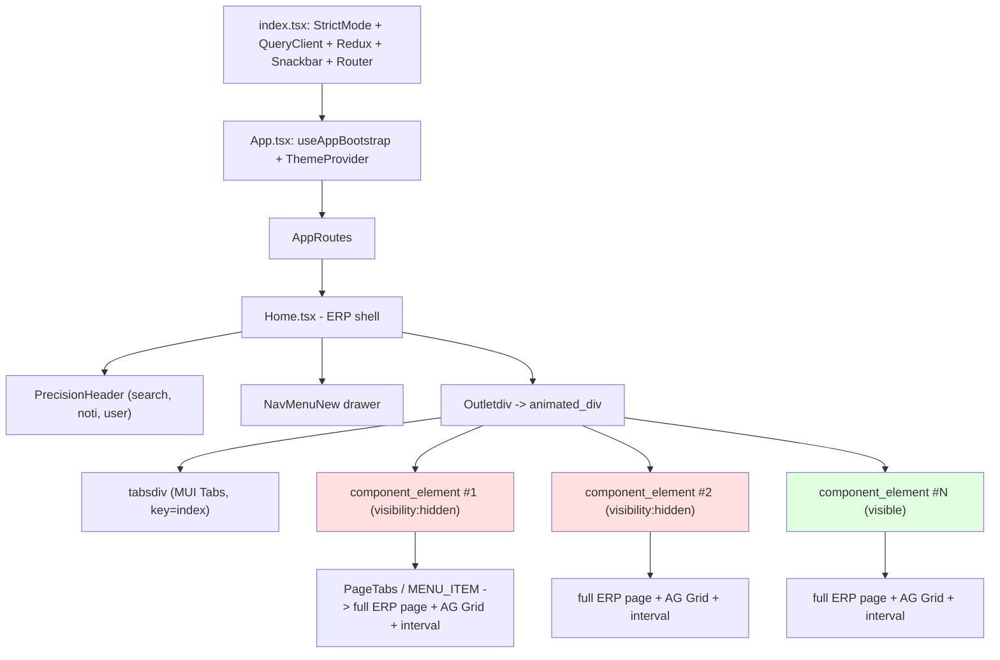

User: #attachment:Pasted text #1 

GitHub Copilot: I'll start by pulling up my prior notes on this workspace and the core config/entry files.

Read 

Read 

Read memory 

Read memory 

No matches found. Your search pattern might be excluded completely by either the search.exclude settings or .*ignore files.
If you believe that it should have results, you can check into the .*ignore files and the exclude setting (here are some excluded patterns for reference:[**/node_modules,**/bower_components,**/*.code-search,**/.dart_tool]).
Then if you want to include those files you can call the tool again by setting "includeIgnoredFiles" to true.

Searched for regex `import .* from ['\"]\.\/|import .* from ['\"]\.\.\/` (`cmsnewerp2` · `src/App.tsx`), 14 results

Created 10 todos

Read 

Read 

Read , lines 1 to 60

No matches found. Your search pattern might be excluded completely by either the search.exclude settings or .*ignore files.
If you believe that it should have results, you can check into the .*ignore files and the exclude setting (here are some excluded patterns for reference:[**/node_modules,**/bower_components,**/*.code-search,**/.dart_tool]).
Then if you want to include those files you can call the tool again by setting "includeIgnoredFiles" to true.

No matches found. Your search pattern might be excluded completely by either the search.exclude settings or .*ignore files.
If you believe that it should have results, you can check into the .*ignore files and the exclude setting (here are some excluded patterns for reference:[**/node_modules,**/bower_components,**/*.code-search,**/.dart_tool]).
Then if you want to include those files you can call the tool again by setting "includeIgnoredFiles" to true.

Read , lines 1 to 120

Read 

Read 

Searched for regex `transition:\s*all` (`cmsnewerp2` · `src/**`), 201 results

Searched for regex `backdrop-filter` (`cmsnewerp2` · `src/**`), 87 results

Searched for regex `setInterval\(` (`cmsnewerp2` · `src/**`), 29 results

Ran terminal command: Set-Location 'g:\NODEJS\WEBCMS ERP2\cmsnewerp2'; if (Test-Path dist) { 'DIST EXISTS' } else { 'NO DIST' }; Get-ChildItem -Recurse -Include *.tsx,*.ts -Path src | Measure-Object -Property Length -Sum | Select-Object Count,Sum; Get-ChildItem -Recurse -Include *.scss -Path src | Measure-Object -Property Length -Sum | Select-Object Count,Sum; (Get-ChildItem -Recurse -File -Path src | Measure-Object).Count

Ran terminal command: Set-Location 'g:\NODEJS\WEBCMS ERP2\cmsnewerp2'; Get-ChildItem dist -Recurse -File | Measure-Object -Property Length -Sum | Select-Object Count,@{n='MB';e={[math]::Round($_.Sum/1MB,2)}}; '--- TOP 25 LARGEST ASSETS ---'; Get-ChildItem dist -Recurse -File | Sort-Object Length -Descending | Select-Object -First 25 @{n='KB';e={[math]::Round($_.Length/1KB,1)}},Name; '--- INDEX.HTML ---'; Get-Content dist/index.html

Ran terminal command: Set-Location 'g:\NODEJS\WEBCMS ERP2\cmsnewerp2'; '=== dist/assets total ==='; Get-ChildItem dist/assets -File | Measure-Object -Property Length -Sum | Select-Object Count,@{n='MB';e={[math]::Round($_.Sum/1MB,2)}} | Format-List; '=== TOP 20 JS/CSS in assets ==='; Get-ChildItem dist/assets -File | Sort-Object Length -Descending | Select-Object -First 20 | ForEach-Object { "$([math]::Round($_.Length/1KB,1)) KB  $($_.Name)" }

Ran terminal command: Set-Location 'g:\NODEJS\WEBCMS ERP2\cmsnewerp2'; (Get-Item build-log.txt).Length; '--- tail ---'; Get-Content build-log.txt -Tail 60

Ran terminal command: Set-Location 'g:\NODEJS\WEBCMS ERP2\cmsnewerp2\dist\assets'; $files = @('Sx2-Qnjk.js','DuTblY7Z.js','DNG-BLrN.js','ZmI6jk-Q.js','D_0l8YDs.js','DLN9SlEe.js','BI9EkvGN.js','C5S46NFB.js','kbZGOIEI.js','B8bK1Mow.js','BnBRaOs9.js','BLqxMtpj.js','DVH8V2ta.js','BNC-71HV.js'); $marks = @{ 'devextreme'='DevExpress or dxDataGrid'; 'ag-grid'='ag-Grid'; 'face-api'='faceapi'; 'opencv'='OpenCV'; 'monaco'='monaco'; 'recharts'='recharts'; 'reactflow'='reactflow'; 'xlsx'='SheetJS'; 'moment'='moment'; 'MuiBox'='MUI'; 'lodash'='lodash'; 'socket.io'='socketio'; 'exceljs'='exceljs'; 'html2canvas'='html2canvas'; 'sweetalert2'='sweetalert2' }; foreach ($f in $files) { if (-not (Test-Path $f)) { continue }; $size=[math]::Round((Get-Item $f).Length/1KB,0); $hits=@(); foreach ($k in $marks.Keys) { if (Select-String -Path $f -SimpleMatch -Pattern $k -List -Quiet) { $hits += $k } }; "$f ($size KB) => $($hits -join ', ')" }

Ran terminal command: Set-Location 'g:\NODEJS\WEBCMS ERP2\cmsnewerp2'; Get-ChildItem -Recurse -Include *.tsx,*.ts,*.scss -Path src | ForEach-Object { [PSCustomObject]@{ Lines = (Get-Content $_.FullName | Measure-Object -Line).Lines; Path = $_.FullName.Replace((Get-Location).Path + '','') } } | Sort-Object Lines -Descending | Select-Object -First 30 | ForEach-Object { "$($_.Lines)`t$($_.Path)" }

Searched for regex `from\s+["'][^"']*[Bb]ackup[^"']*["']` (`cmsnewerp2` · `src/**`), 4 results

Read , lines 1 to 140

Read , lines 180 to 420

Read , lines 420 to 664

Searched for regex `devextreme|DevExtreme|DxDataGrid|DataGrid from "devextreme` (`cmsnewerp2` · `src/**`), 63 results

Searched for regex `@import|@use` (`cmsnewerp2` · `src/index.css`), 1 result

No matches found. Your search pattern might be excluded completely by either the search.exclude settings or .*ignore files.
If you believe that it should have results, you can check into the .*ignore files and the exclude setting (here are some excluded patterns for reference:[**/node_modules,**/bower_components,**/*.code-search,**/.dart_tool]).
Then if you want to include those files you can call the tool again by setting "includeIgnoredFiles" to true.

Ran terminal command: Set-Location 'g:\NODEJS\WEBCMS ERP2\cmsnewerp2\dist\assets'; foreach ($f in @('D6qplwZW..css','DvjQfKrP..css','DuHWpLBQ..css','B12z2DCF..css')) { if (Test-Path -LiteralPath $f) { $kb=[math]::Round((Get-Item -LiteralPath $f).Length/1KB,1); $dx=(Select-String -LiteralPath $f -SimpleMatch -Pattern '.dx-' -AllMatches | ForEach-Object { $_.Matches.Count } | Measure-Object -Sum).Sum; $ag=(Select-String -LiteralPath $f -SimpleMatch -Pattern '.ag-' -AllMatches | ForEach-Object { $_.Matches.Count } | Measure-Object -Sum).Sum; $pp=(Select-String -LiteralPath $f -SimpleMatch -Pattern '.precision-' -AllMatches | ForEach-Object { $_.Matches.Count } | Measure-Object -Sum).Sum; $mui=(Select-String -LiteralPath $f -SimpleMatch -Pattern '.Mui' -AllMatches | ForEach-Object { $_.Matches.Count } | Measure-Object -Sum).Sum; "$f => $kb KB | .dx-=$dx .ag-=$ag .precision-=$pp .Mui=$mui" } else { "$f MISSING" } }

Ran terminal command: Set-Location 'g:\NODEJS\WEBCMS ERP2\cmsnewerp2\dist\assets'; foreach ($f in @('D6qplwZW..css','DvjQfKrP..css','DuHWpLBQ..css','B12z2DCF..css')) { $c = Get-Content -LiteralPath $f -Raw; $kb=[math]::Round((Get-Item -LiteralPath $f).Length/1KB,1); $dx=[regex]::Matches($c,'\.dx-').Count; $ag=[regex]::Matches($c,'\.ag-').Count; $pp=[regex]::Matches($c,'\.precision-').Count; $mui=[regex]::Matches($c,'\.Mui').Count; $tw=[regex]::Matches($c,'\.tw-|--tw-').Count; "=== $f ($kb KB) dx=$dx ag=$ag precision=$pp Mui=$mui tw=$tw ==="; $c.Substring(0,[Math]::Min(300,$c.Length)); '' }

Searched for regex `component_element|outletdiv|animated_div|is-scrolling` (`cmsnewerp2` · `src/pages/home/home.scss`), 10 results

Ran terminal command: try { $r = Invoke-WebRequest -Uri 'http://localhost:3001' -UseBasicParsing -TimeoutSec 5; "UP: $($r.StatusCode) length=$($r.RawContentLength)" } catch { "DOWN: $($_.Exception.Message)" }

Read , lines 20 to 120

Read , lines 240 to 300

Opened `Browser`

Read `Browser`

Ran Playwright code
Completed with input: return page.evaluate(() => ({ url: location.href, title: document.title, rootChildren: document.getElementById('root')?.children.length, bodyText: (document.body.innerText || '').slice(0, 400), scriptCount: document.scripts.length, cssCount: document.styleSheets.length, domNodes: document.querySelectorAll('*').length }))

Ran Playwright code
Completed with input: return page.evaluate(() => {
  const tabs = Array.from(document.querySelectorAll('.component_element'));
  return {
    tabCount: tabs.length,
    tabs: tabs.map((t, i) => ({
      i,
      visibility: getComputedStyle(t).visibility,
      rect: (r => ({ w: Math.round(r.width), h: Math.round(r.height), top: Math.round(r.top) }))(t.getBoundingClientRect()),
      domNodes: t.querySelectorAll('*').length,
      agGrids: t.querySelectorAll('.ag-root-wrapper').length,
      canvases: t.querySelectorAll('canvas').length,
      svgs: t.querySelectorAll('svg').length,
      imgs: t.querySelectorAll('img').length,
      btnCount: t.querySelectorAll('button').length,
      firstChildSummary: (t.firstElementChild && (t.firstElementChild.className || '').toString().slice(0, 80)) || ''
    })),
    totalDom: document.querySelectorAll('*').length,
    totalAgGrids: document.querySelectorAll('.ag-root-wrapper').length,
    totalCanvases: document.querySelectorAll('canvas').length,
    totalSvgs: document.querySelectorAll('svg').length,
    totalStyleSheets: document.styleSheets.length,
    totalCssRules: Array.from(document.styleSheets).reduce((a, s) => { try { return a + s.cssRules.length } catch (e) { return a } }, 0)
  };
})

Ran Playwright code
Completed with input: return page.evaluate(() => {
  const rows = [];
  for (const s of Array.from(document.styleSheets)) {
    let n = 0, dx = 0, ag = 0, prec = 0;
    try {
      const rules = s.cssRules; n = rules.length;
      for (const r of rules) {
        const t = r.cssText || '';
        if (t.includes('.dx-')) dx++;
        if (t.includes('.ag-')) ag++;
        if (t.includes('.precision-')) prec++;
      }
    } catch (e) { n = -1 }
    rows.push({ href: s.href ? s.href.split('/').pop() : '(inline ' + (s.ownerNode?.textContent || '').slice(0, 40).replace(/\s+/g, ' ') + ')', rules: n, dx, ag, prec });
  }
  rows.sort((a, b) => b.rules - a.rules);
  return { total: rows.reduce((a, r) => a + Math.max(r.rules, 0), 0), sheets: rows.slice(0, 12), dxTotal: rows.reduce((a, r) => a + r.dx, 0), agTotal: rows.reduce((a, r) => a + r.ag, 0), precTotal: rows.reduce((a, r) => a + r.prec, 0), allSheetCount: rows.length };
})

Ran terminal command: Set-Location 'g:\NODEJS\WEBCMS ERP2\cmsnewerp2\src\pages\home'; (Get-Item menuConfig.tsx).Length; (Get-Content menuConfig.tsx | Measure-Object -Line).Lines; '--- lazy/import counts ---'; (Select-String -Path menuConfig.tsx -Pattern 'React\.lazy|^import ' -AllMatches).Count; (Select-String -Path menuConfig.tsx -Pattern 'React\.lazy' ).Count

Read 

Ran terminal command: Set-Location 'g:\NODEJS\WEBCMS ERP2\cmsnewerp2\src\pages\home\menu'; Get-ChildItem | ForEach-Object { "$([math]::Round($_.Length/1KB,1)) KB`t$($_.Name)" }; '--- static imports vs lazy in CMS_MENU ---'; $c = Get-Content CMS_MENU.tsx -Raw; "staticImports: " + ([regex]::Matches($c,'(?m)^import\s')).Count; "lazyRefs: " + ([regex]::Matches($c,'lazy\(')).Count; "MENU_ITEM entries: " + ([regex]::Matches($c,'MENU_ITEM:')).Count

Read , lines 1 to 60

Ran Playwright code
Completed with input: return page.evaluate(() => {
  const mods = [];
  for (const s of Array.from(document.styleSheets)) {
    let first = '';
    try { first = (s.cssRules[0]?.cssText || '').slice(0, 70).replace(/\s+/g, ' '); } catch (e) {}
    mods.push(first);
  }
  const prefixSet = {};
  for (const t of mods) {
    const m = t.match(/\.(precision-[\w-]+|stitch-[\w-]+|dx-[\w-]+|ag-[\w-]+|[a-z][\w-]*)/);
    if (m) prefixSet[m[1]] = (prefixSet[m[1]] || 0) + 1;
  }
  return { sheetCount: mods.length, uniqueNamespaces: Object.keys(prefixSet).length, namespaces: Object.keys(prefixSet).sort(), sampleFirstSelectors: mods.slice(0, 40) };
})

Ran terminal command: Set-Location 'g:\NODEJS\WEBCMS ERP2\cmsnewerp2\src\components\NavMenu'; Get-ChildItem | ForEach-Object { "$([math]::Round($_.Length/1KB,1)) KB`t$($_.Name)" }; '--- imports in getNavMenu / navMenuSearch ---'; Select-String -Path getNavMenu.tsx,navMenuSearch.ts -Pattern '^\s*import' | ForEach-Object { "$($_.Filename):$($_.LineNumber): $($_.Line.Trim().Substring(0,[Math]::Min(140,$_.Line.Trim().Length)))" }

Ran Playwright code
Completed with input: return page.evaluate(() => {
  const res = performance.getEntriesByType('resource').map(r => r.name);
  const src = res.filter(n => n.includes('/src/'));
  const pageMods = src.filter(n => n.includes('/pages/'));
  const scss = src.filter(n => n.endsWith('.scss') || n.includes('.scss?'));
  return {
    totalRequests: res.length,
    srcModules: src.length,
    scssRequests: scss.length,
    pageModuleCount: pageMods.length,
    uniquePageTopFolders: Array.from(new Set(pageMods.map(n => n.replace(/^.*\/src\/pages\//, '').split('/')[0]))).sort(),
    sampleScss: scss.slice(0, 25).map(n => n.split('/src/')[1])
  };
})

Ran terminal command: Set-Location 'g:\NODEJS\WEBCMS ERP2\cmsnewerp2\src\pages\precision'; Get-ChildItem -Recurse -File | ForEach-Object { "$([math]::Round($_.Length/1KB,1)) KB`t$($_.FullName.Replace((Get-Location).Path+'',''))" }; '--- imports ---'; Get-ChildItem -Recurse -Include *.tsx,*.ts | ForEach-Object { $n=$_.Name; Select-String -Path $_.FullName -Pattern '^\s*import' | ForEach-Object { "$n : $($_.Line.Trim().Substring(0,[Math]::Min(120,$_.Line.Trim().Length)))" } } | Select-Object -First 60

Ran Playwright code
Completed with input: return page.evaluate(() => {
  window.__lt = [];
  window.__consoleLogs = [];
  if (!window.__ltP) {
    window.__ltP = new PerformanceObserver((list) => {
      for (const e of list.getEntries()) {
        const a = (e.attribution && e.attribution[0]) || {};
        window.__lt.push({ t: Math.round(e.startTime), dur: Math.round(e.duration), name: a.name, src: (a.containerSrc || '').split('/').slice(-2).join('/') });
      }
    });
    window.__ltP.observe({ type: 'longtask', buffered: true });
  }
  if (!window.__logP) {
    const orig = console.log;
    console.log = function (...args) { try { window.__consoleLogs.push(args.map(a => typeof a === 'string' ? a : JSON.stringify(a)).join(' ').slice(0, 120)); } catch (e) {} return orig.apply(this, args); };
    window.__logP = true;
  }
  return { installed: true, existingLongTasks: window.__lt.length };
})

Ran Playwright code
Completed with input: await page.evaluate(() => { window.__lt = []; window.__consoleLogs = []; });
const box = page.getByRole('textbox', { name: /Tìm nhanh chức năng/ });
await box.click();
for (const ch of ['k','h','o','a','n','g']) { await box.type(ch, { delay: 40 }); }
await page.waitForTimeout(1200);
return page.evaluate(() => ({ longTasks: window.__lt, homeRerenderLogs: window.__consoleLogs.filter(l => l.includes('Home re-render')).length, otherLogs: window.__consoleLogs.filter(l => !l.includes('Home re-render')).slice(0,10), domNodes: document.querySelectorAll('*').length, styleSheetCount: document.styleSheets.length }))

Ran Playwright code
Completed with input: await page.evaluate(() => { window.__lt = []; window.__consoleLogs = []; window.__raf = 0; const c = () => { window.__raf++; requestAnimationFrame(c); }; requestAnimationFrame(c); });
await page.waitForTimeout(10000);
const r1 = await page.evaluate(() => ({ longTasks: window.__lt.length, longTaskTotalMs: window.__lt.reduce((a,b)=>a+b.dur,0), worst: Math.max(0, ...window.__lt.map(b=>b.dur)), rafFrames: window.__raf, logs: window.__consoleLogs.length, sampleLogs: Array.from(new Set(window.__consoleLogs)).slice(0,12) }));
return r1;

Waited for Playwright code

Searched for regex `precision-modal-backdrop|stitch-modal|modalBackdrop|precision-modal` (`cmsnewerp2` · `src/**/*.tsx`), 7 results

Searched for regex `useRenderLag|useWhyDidYouUpdate|console\.log\("company"|Home re-render caused` (`cmsnewerp2` · `src/**/*.tsx`), 4 results

Read , lines 1 to 200

Read , lines 200 to 301

Searched for regex `columns=\{` (`cmsnewerp2` · `src/**/Precision*/**/*.tsx`), 78 results

Searched for regex `getRowStyle=\{\(|getRowId=\{\(|getRowStyle=\{\(p` (`cmsnewerp2` · `src/**`), 12 results

Searched for regex `const columns|useMemo\(.*columns|columns =|columnDefinition` (`cmsnewerp2` · `src/pages/kinhdoanh/ycsxmanager/PrecisionYCSX/**`), 6 results

Read , lines 1 to 140

Read , lines 380 to 464

Ran Playwright code
Completed with input: return page.evaluate(() => {
  const res = performance.getEntriesByType('resource').filter(r => r.initiatorType === 'xmlhttprequest' || r.initiatorType === 'fetch');
  const byHost = {};
  for (const r of res) { const h = new URL(r.name).host; byHost[h] = (byHost[h]||0)+1; }
  return {
    apiCalls: res.length,
    byHost,
    calls: res.map(r => ({ url: r.name.replace(/^https?:\/\//,'').slice(0,110), ms: Math.round(r.duration), size: r.transferSize, start: Math.round(r.startTime) })).slice(0, 30)
  };
})

Ran Playwright code
Completed with input: await page.evaluate(() => { window.__lt = []; window.__t0 = performance.now(); });
await page.getByRole('link', { name: /Báo Cáo Nhân Sự NS8/ }).click();
await page.waitForTimeout(3500);
return page.evaluate(() => ({
  url: location.href,
  elapsedMs: Math.round(performance.now() - window.__t0),
  longTasks: window.__lt,
  domNodes: document.querySelectorAll('*').length,
  tabCount: document.querySelectorAll('.component_element').length,
  agGrids: document.querySelectorAll('.ag-root-wrapper').length
}));

Ran Playwright code
Completed with input: await page.evaluate(() => { window.__lt = []; window.__raf = 0; const c = () => { window.__raf++; requestAnimationFrame(c); }; requestAnimationFrame(c); });
await page.waitForTimeout(8000);
const three = await page.evaluate(() => ({ tabs: document.querySelectorAll('.component_element').length, agGrids: document.querySelectorAll('.ag-root-wrapper').length, domNodes: document.querySelectorAll('*').length, longTasks: window.__lt.length, totalMs: window.__lt.reduce((a,b)=>a+b.dur,0), worst: Math.max(0,...window.__lt.map(b=>b.dur)), raf: window.__raf }));
return three;

Waited for Playwright code

Searched for regex `useSelector\(\(state: RootState\) => \(\{` (`cmsnewerp2` · `src/**/*.tsx`), 1 result

Searched for regex `animateRows|rowDragManaged` (`cmsnewerp2` · `src/**`), 2 results

Searched for regex `@keyframes` (`cmsnewerp2` · `src/**/*.scss`), 26 results

Ran Playwright code
Completed with input: await page.evaluate(() => { window.__lt = []; window.__t0 = performance.now(); });
const tabs = page.locator('.erpTab');
const n = await tabs.count();
if (n > 1) { await tabs.nth(0).click(); }
await page.waitForTimeout(2500);
return page.evaluate(() => ({ elapsed: Math.round(performance.now()-window.__t0), longTasks: window.__lt, domNodes: document.querySelectorAll('*').length }));

Browser action failed

Ran Playwright code
Completed with input: await page.waitForTimeout(6000);
return page.evaluate(() => ({ swalOpen: !!document.querySelector('.swal2-container'), tabs: document.querySelectorAll('.component_element').length, agGrids: document.querySelectorAll('.ag-root-wrapper').length, domNodes: document.querySelectorAll('*').length, longTasks: window.__lt.length, totalMs: window.__lt.reduce((a,b)=>a+b.dur,0) }))

Waited for Playwright code

Ran terminal command: Set-Location 'g:\NODEJS\WEBCMS ERP2\cmsnewerp2\dist\assets'; $tests = @{ 'MonacoEnvironment'='monaco'; 'monaco-editor'='monaco2'; 'DevExpress'='devextreme'; 'dxPivotGrid'='dxPivot'; '@handsontable'='handsontable'; 'faceapi'='faceapi'; 'cv.Mat'='opencv'; 'reactflow'='reactflow'; 'SheetJS'='xlsx'; 'jsbarcode'='barcode'; 'lottie'='lottie'; 'ag-charts'='agcharts'; 'html2canvas'='html2canvas'; 'ckeditor'='ckeditor'; 'tinymce'='tinymce'; 'exceljs'='exceljs'; 'moment-timezone'='momenttz' }; foreach ($f in @('Sx2-Qnjk.js','DuTblY7Z.js','DNG-BLrN.js','ZmI6jk-Q.js','D_0l8YDs.js','BI9EkvGN.js','kbZGOIEI.js','C5S46NFB.js','DLN9SlEe.js')) { $c = Get-Content -LiteralPath $f -Raw; $hits=@(); foreach ($k in $tests.Keys) { if ($c.Contains($k)) { $hits += $tests[$k] } }; "$f => $($hits -join ', ')" }

Searched for regex `monaco` (`cmsnewerp2` · `src/**`), 29 results

Searched for regex `reactflow|ReactFlow` (`cmsnewerp2` · `src/**`), 40 results

Ran terminal command: Set-Location 'g:\NODEJS\WEBCMS ERP2\cmsnewerp2'; Get-ChildItem -Recurse -Filter 'PageTabs.tsx' -Path src | ForEach-Object { $_.FullName; Get-Content $_.FullName -TotalCount 40 | Select-String -Pattern '^\s*import' | ForEach-Object { '   ' + $_.Line.Trim() } }

Ran terminal command: Set-Location 'g:\NODEJS\WEBCMS ERP2\cmsnewerp2\src\pages\nocodelowcode'; Get-ChildItem -Recurse -Include *.tsx,*.ts | ForEach-Object { $f=$_.FullName; $m = Select-String -Path $f -Pattern "monaco|@monaco-editor|object-editor|DevExpress" | Select-Object -First 1; if ($m) { "$($f.Replace((Get-Location).Path+'','')) : line $($m.LineNumber): $($m.Line.Trim().Substring(0,[Math]::Min(90,$m.Line.Trim().Length)))" } } | Select-Object -First 20; '--- who imports Page.tsx chain ---'; Get-ChildItem -Recurse -Include *.tsx -Filter 'Page.tsx' | ForEach-Object { $_.FullName; Get-Content $_.FullName -TotalCount 30 | Select-String -Pattern '^\s*import' | ForEach-Object { '   ' + $_.Line.Trim() } }

Searched for regex `SqlEditor|QueryManager|TestBackEnd` (`cmsnewerp2` · `src/**`), 11 results

Ran Playwright code
Completed with input: return page.evaluate(() => {
  const res = performance.getEntriesByType('resource');
  const fonts = res.filter(r => /fonts\.(googleapis|gstatic)\.com/.test(r.name)).map(r => ({ n: r.name.replace(/^https:\/\//,'').slice(0,90), start: Math.round(r.startTime), dur: Math.round(r.duration), size: r.transferSize, status: 'n/a' }));
  const localFonts = res.filter(r => /\.(woff2?|ttf|otf|eot)(\?|$)/.test(r.name) && !/fonts\.googleapis/.test(r.name)).map(r => ({ n: r.name.split('/').slice(-1)[0].slice(0,50), dur: Math.round(r.duration), size: r.transferSize }));
  return { googleFontRequests: fonts, count: fonts.length, localFonts, localFontCount: localFonts.length, fontsStatus: document.fonts.status, fontsSize: document.fonts.size, navTiming: { domContentLoaded: Math.round(performance.getEntriesByType('navigation')[0].domContentLoadedEventEnd), loadEvent: Math.round(performance.getEntriesByType('navigation')[0].loadEventEnd), domInteractive: Math.round(performance.getEntriesByType('navigation')[0].domInteractive) } };
})

Ran terminal command: Set-Location 'g:\NODEJS\WEBCMS ERP2\cmsnewerp2'; npx vite preview --port 3002 --strictPort

Opened `Browser`

Ran Playwright code
Completed with input: return page.evaluate(() => {
  const nav = performance.getEntriesByType('navigation')[0];
  const paint = performance.getEntriesByType('paint').map(p => ({ name: p.name, t: Math.round(p.startTime) }));
  const res = performance.getEntriesByType('resource');
  const js = res.filter(r => r.name.endsWith('.js'));
  const css = res.filter(r => r.name.includes('.css'));
  const sum = a => a.reduce((x, r) => x + (r.transferSize || r.encodedBodySize || 0), 0);
  const raw = a => a.reduce((x, r) => x + (r.decodedBodySize || 0), 0);
  const fonts = res.filter(r => /\.(woff2?|ttf)$/.test(r.name)).map(r => ({ f: r.name.split('/').pop(), kb: Math.round(r.decodedBodySize/1024) }));
  return {
    nav: { domInteractive: Math.round(nav.domInteractive), domContentLoaded: Math.round(nav.domContentLoadedEventEnd), loadEvent: Math.round(nav.loadEventEnd), ttfb: Math.round(nav.responseStart) },
    paint,
    jsCount: js.length, jsTransferredKB: Math.round(sum(js)/1024), jsDecodedKB: Math.round(raw(js)/1024),
    cssCount: css.length, cssDecodedKB: Math.round(raw(css)/1024),
    fonts,
    topJs: js.map(r => ({ n: r.name.split('/').pop(), start: Math.round(r.startTime), dur: Math.round(r.duration), decodedKB: Math.round((r.decodedBodySize||0)/1024) })).sort((a,b)=>b.decodedKB-a.decodedKB).slice(0,10),
    totalRequests: res.length
  };
})

Ran Playwright code
Completed with input: await page.addInitScript(() => { window.__lt = []; try { new PerformanceObserver(l => { for (const e of l.getEntries()) window.__lt.push({ s: Math.round(e.startTime), d: Math.round(e.duration) }); }).observe({ type: 'longtask', buffered: true }); } catch (e) {} });
await page.reload({ waitUntil: 'load' });
await page.waitForTimeout(4000);
return page.evaluate(() => {
  const nav = performance.getEntriesByType('navigation')[0];
  return {
    longTasks: window.__lt, longTaskCount: window.__lt.length, totalBlockedMs: window.__lt.reduce((a,b)=>a+b.d,0),
    fcp: Math.round((performance.getEntriesByType('paint').find(p=>p.name==='first-contentful-paint')||{}).startTime || 0),
    domInteractive: Math.round(nav.domInteractive), loadEnd: Math.round(nav.loadEventEnd),
    domNodes: document.querySelectorAll('*').length
  };
})

Ran terminal command: Set-Location 'g:\NODEJS\WEBCMS ERP2\cmsnewerp2'; '=== AGTable usages ==='; (Select-String -Path (Get-ChildItem -Recurse -Include *.tsx -Path src).FullName -Pattern 'from .*DataTable/AGTable' -List).Count; '=== backup files ==='; $b = Get-ChildItem -Recurse -Include *.backup.tsx,*.backup.ts,*.backup.scss,*.backup.css -Path src; "count=$($b.Count) totalKB=$([math]::Round(($b | Measure-Object Length -Sum).Sum/1KB,0))"; '=== public assets top ==='; Get-ChildItem public -Recurse -File | Sort-Object Length -Descending | Select-Object -First 12 | ForEach-Object { "$([math]::Round($_.Length/1KB,0)) KB`t$($_.FullName.Replace((Get-Location).Path+'',''))" }; '=== public total ==='; Get-ChildItem public -Recurse -File | Measure-Object Length -Sum | ForEach-Object { "count=$($_.Count) MB=$([math]::Round($_.Sum/1MB,1))" }
Completed with input: Set-Location 'g:\NODEJS\WEBCMS ERP2\cmsnewerp2'; '=== AGTable usages ==='; (Select-String -Path (Get-ChildItem -Recurse -Include *.tsx -Path src).FullName -Pattern 'from .*DataTable/AGTable' -List).Count; '=== backup files ==='; $b = Get-ChildItem -Recurse -Include *.backup.tsx,*.backup.ts,*.backup.scss,*.backup.css -Path src; "count=$($b.Count) totalKB=$([math]::Round(($b | Measure-Object Length -Sum).Sum/1KB,0))"; '=== public assets top ==='; Get-ChildItem public -Recurse -File | Sort-Object Length -Descending | Select-Object -First 12 | ForEach-Object { "$([math]::Round($_.Length/1KB,0)) KB`t$($_.FullName.Replace((Get-Location).Path+'',''))" }; '=== public total ==='; Get-ChildItem public -Recurse -File | Measure-Object Length -Sum | ForEach-Object { "count=$($_.Count) MB=$([math]::Round($_.Sum/1MB,1))" }

Ran terminal command: Set-Location 'g:\NODEJS\WEBCMS ERP2\cmsnewerp2\src\api'; Get-ChildItem -File | Sort-Object Length -Descending | Select-Object -First 8 | ForEach-Object { "$([math]::Round($_.Length/1KB,0)) KB`t$($_.Name)" }; '=== Api.tsx size/lines ==='; (Get-Content Api.tsx | Measure-Object -Line).Lines; '=== axios / cache / dedupe markers ==='; Select-String -Path Api.tsx -Pattern 'axios.create|new Axios|Cache|cache|debounce|AbortController|localStorage' | Select-Object -First 20 | ForEach-Object { "line $($_.LineNumber): $($_.Line.Trim().Substring(0,[Math]::Min(110,$_.Line.Trim().Length)))" }
Completed with input: Set-Location 'g:\NODEJS\WEBCMS ERP2\cmsnewerp2\src\api'; Get-ChildItem -File | Sort-Object Length -Descending | Select-Object -First 8 | ForEach-Object { "$([math]::Round($_.Length/1KB,0)) KB`t$($_.Name)" }; '=== Api.tsx size/lines ==='; (Get-Content Api.tsx | Measure-Object -Line).Lines; '=== axios / cache / dedupe markers ==='; Select-String -Path Api.tsx -Pattern 'axios.create|new Axios|Cache|cache|debounce|AbortController|localStorage' | Select-Object -First 20 | ForEach-Object { "line $($_.LineNumber): $($_.Line.Trim().Substring(0,[Math]::Min(110,$_.Line.Trim().Length)))" }

Read , lines 1 to 120

Searched for regex `useQuery|useMutation|QueryClientProvider|useInfiniteQuery` (`cmsnewerp2` · `src/**`), 3 results

Searched for regex `new ResizeObserver|ResizeObserver\(` (`cmsnewerp2` · `src/**`), 4 results

Read 

Starting: *Build scorecard + top bottlenecks report* (10/10)

Created memory file 

Killed terminal

Ran terminal command: Set-Location 'g:\NODEJS\WEBCMS ERP2\cmsnewerp2'; $files = @('src\components\Navbar\AccountInfo\components\PrecisionStatusBanner.tsx','src\components\Navbar\AccountInfo\PrecisionAccountInfo.tsx','src\pages\kinhdoanh\poandstockfull\PrecisionPOandStockFull\PrecisionPOandStockFullTab.tsx','src\pages\nhansu\DiemDanhNhom\PrecisionDiemDanh\PrecisionDiemDanhFooter.tsx','src\pages\qc\oqc\PrecisionVOCHistory\PrecisionVOCHistoryHeader.tsx','src\pages\qlsx\QLSXPLAN\EQ_STATUS\PrecisionEqStatus\PrecisionEqStatusHeader.tsx','src\pages\qlsx\QLSXPLAN\EQ_STATUS\PrecisionEqStatus\useEqStatusData.ts','src\pages\qlsx\QLSXPLAN\Machine\PrecisionMachine\dashboard\PrecisionMachineStatusBar.tsx','src\pages\qlsx\QLSXPLAN\Machine\PrecisionMachine\useMachineData.ts'); foreach ($f in $files) { $c = Get-Content $f -Raw; $si = ([regex]::Matches($c,'setInterval\(')).Count; $ci = ([regex]::Matches($c,'clearInterval\(')).Count; $cancelled = ([regex]::Matches($c,'cancelled|isMounted|mountedRef')).Count; "$([System.IO.Path]::GetFileName($f)): setInterval=$si clearInterval=$ci guardFlag=$cancelled" }

# 🔍 PERFORMANCE AUDIT — CMS ERP (cmsnewerp2) sau refactor UI theo Google Stitch

> **Phương pháp**: không đoán. Tôi đã (1) quét source, (2) chạy dev server `:3001` thật + instrument `PerformanceObserver` trong trình duyệt, (3) dựng **production build** (`npx vite preview :3002`) để đo số thật. Mọi con số dưới đây đều là **số đo được**, có file/dòng cụ thể. Những điểm chỉ là suy luận đều được ghi rõ là "chưa chứng minh".
>
> **Trạng thái**: chỉ audit — **chưa sửa 1 dòng code nào**.

---

## A. ARCHITECTURE OVERVIEW

| Hạng mục | Hiện trạng |
|---|---|
| Framework | React **18.3.1** (`react-dom/client` + `StrictMode`) |
| Build tool | **Vite 5.4.3** + `@vitejs/plugin-react`, TypeScript 5.9.3 |
| UI framework | **MUI 7.3.9** (material + icons + system) + `@emotion/styled` + `styled-components` 6 + **Tailwind 4** (đang bị comment trong `index.css`) |
| Grid | **AG Grid 32.1.0** (qua wrapper `AGTable.tsx` — **228 chỗ dùng**) + `material-react-table` + `@mui/x-data-grid` + `react-window` |
| Pivot | **DevExtreme 22.2.4** (`PivotGridDataSource`) — dùng ở ~40 file |
| Chart | `recharts` + `devextreme-react/chart` |
| State | **Redux Toolkit** (`src/redux/store`) — 1 slice lớn `totalSlice`; KHÔNG dùng Zustand/Jotai |
| Data fetching | `axios 0.27` qua `Api.ts` (hàm `generalQuery`). **Không cache, không dedupe.** `@tanstack/react-query` được provider ở `index.tsx` nhưng **0 lần dùng** `useQuery/useMutation` |
| Routing | `react-router-dom` 6.3 + **`React.lazy` cho ~200 page** (`lazyPages.ts`) |
| Realtime | `socket.io-client` (1 socket trong redux, `useSocketEvents`) |
| Font/Icon | Google Fonts (Inter, JetBrains Mono, Plus Jakarta Sans, Roboto) + **Material Symbols Outlined** + `react-icons` |
| Providers | `QueryClientProvider` → `Provider(store)` → `SnackbarProvider` → `BrowserRouter` → `ThemeProvider(MUI)` + `CssBaseline` + `ChangelogHost` + `Notifications` |
| Error boundary | `ErrorBoundary` bọc `AppRoutes` (chỉ 1, đặt cấp app) |
| Code splitting | `manualChunks` thủ công trong `vite.config.mts` (11 nhóm) |

**ERP shell** (`Home.tsx`) — đây là trái tim của vấn đề:

**Kết luận kiến trúc**: App có 2 tầng "splitting" cho page (route lazy + tab system), nhưng **mọi tab đã mở vẫn nằm trong DOM vĩnh viễn**, và **initial bundle bị kéo phình bởi `manualChunks`**.

---

## B. PERFORMANCE SCORECARD (có bằng chứng)

| # | Category | Issue | Severity | Evidence | Impact | File / Line |
|---|---|---|---|---|---|---|
| 1 | Bundle | **17.301 KB JS phải parse + 4.478 KB tải** trước FCP | 🔴 CRITICAL | Prod đo được: `jsDecodedKB: 17301`, `jsTransferredKB: 4478`, FCP **1044ms** (cold) / **588ms** (warm) | Initial load nặng; trên mạng nhà máy/VPN có thể 5–15s | `index.html`, `vite.config.mts` |
| 2 | Bundle | **9.609 KB vendor chunk** chứa **monaco-editor** + devextreme, được `modulepreload` ngay đầu | 🔴 CRITICAL | Chuỗi import tĩnh: `Home.tsx` → `PageTabs` → `Page.tsx` → `TableFromQueryComponent.tsx:6` → `QueryManager.tsx` → `@monaco-editor/react` | Monaco chỉ dùng ở 1 trang no-code nhưng bị tải cho **mọi user** | `TableFromQueryComponent.tsx:6`, `QueryManager.tsx:14`, `nocodelowcodeUtils.ts:4` |
| 3 | CSS | **1.128 KB CSS render-blocking**, trong đó **774 KB là DevExtreme theme** (`dx.light.css`, 22.833 selector `.dx-`) | 🔴 CRITICAL | Prod: `cssDecodedKB: 1128`, 5 file; `DvjQfKrP.css` = 774 KB, `dx=` 22.833 | Chặn render; DevExtreme chỉ dùng `PivotGridDataSource` (không cần theme) | `src/App.tsx:1` |
| 4 | React/Layout | **Mọi tab ERP vẫn mount vĩnh viễn** (chỉ ẩn bằng `visibility:hidden`) | 🔴 CRITICAL | 2 tab = 1.910 DOM / 2 grid; **+1 tab = 7.191 DOM / 6 grid**, 7 long task / **688ms block** trong 3.7s (worst 160ms) | Tab switching, layout, memory đều xấu đi theo số tab | `Home.tsx` (~L585-620), `home.scss:46` |
| 5 | DataGrid | `AGTable` bật **`animateRows` + `rowDragManaged` cho MỌI bảng** (228 chỗ dùng) | 🟠 HIGH | `AGTable.tsx:234-235` | Animation + drag machinery trên mọi row của mọi grid | `DataTable/AGTable.tsx` |
| 6 | DataGrid | `defaultColDef` bật **`editable` + `filter` + `floatingFilter`** cho mọi cột ⇒ mỗi grid có thêm 1 hàng input | 🟠 HIGH | `AGTable.tsx:70-79`, `floatingFiltersHeight={23}` ở L241 | DOM + layout tăng theo cột × grid; kết hợp #4 nhân lên nhiều lần | `DataTable/AGTable.tsx` |
| 7 | DataGrid | **`columnDefs` bị tạo lại mỗi lần search** → AG Grid dựng lại cấu trúc cột | 🟠 HIGH | `setColumnDefinition(isCMS ? getColumnsCodeCMS() : getColumnsCodePVN())` trong `handletraPOFullCMS` | Full column rebuild mỗi lần tìm | `PrecisionPOandStockFullTab.tsx:47-49, 111` |
| 8 | DataGrid | **`new PivotGridDataSource()` được tạo cho mọi grid** kể cả khi modal pivot chưa mở | 🟠 HIGH | `AGTable.tsx:112-119` (`useMemo` không guard `showhidePivotTable`) | Cấp phát nặng + giữ reference `store: ag_data.data` | `DataTable/AGTable.tsx` |
| 9 | Network | **Google Fonts là stylesheet render-blocking cross-origin** (2 link) + Material Symbols | 🟠 HIGH | `index.html`; đo được 176–178ms/link ở máy này (LAN nhà máy sẽ tệ hơn nhiều) | FCP/LCP phụ thuộc internet; icon hiện chữ khi font chưa về | `index.html` |
| 10 | Bundle | **Static import page nặng trong `AppRoutes.tsx`** | 🟠 HIGH | `import PrecisionPreviewPage` (→ `PrecisionPoManager`) và `PrecisionAccountInfo` là import tĩnh, không lazy | Kéo Stitch page + SCSS của nó vào initial graph dù user không mở | `src/AppRoutes.tsx:9,11` |
| 11 | React | `Home` re-render theo **state search cục bộ** (`menuSearchText`) | 🟡 MEDIUM | Gõ 6 ký tự ⇒ ~10 lần render `Home` (đếm qua `console.log("company", …)`) | Re-render shell + `PageTabs` mỗi phím; item menu thì được bail-out | `Home.tsx:74, 103-110` |
| 12 | React | Debug còn sót trong production: `console.log` + effect so sánh diff **không có dep array** | 🟡 MEDIUM | `Home.tsx:88-103` — chạy **mỗi lần render** | Object.keys + filter + so sánh 9 khóa mỗi render | `Home.tsx` |
| 13 | React | Tab dùng **`key={index}`** (cả MUI Tabs và `component_element`) | 🟡 MEDIUM | `Home.tsx` vòng `tabs.map((ele, index) => … key={index})` | Đóng tab ⇒ lệch index ⇒ reconcile sai instance, state có thể "nhảy" tab | `Home.tsx` |
| 14 | Bundle | `@tanstack/react-query` được provide nhưng **không dùng ở đâu** | 🟡 MEDIUM | grep toàn `src`: chỉ có ở `index.tsx` | Dead dependency trong bundle | `index.tsx:9,26` |
| 15 | Dead code | **126 file `.backup.*` = 3.477 KB source**, 3 file backup còn được import thật | 🟡 MEDIUM | `AccountInfo.tsx:3`, `PrecisionPlanDataTbPrintModals.tsx:11`, `PLAN_DATATB*.tsx` | Nhiễu module graph, dễ build lẫn code cũ | toàn `src` |
| 16 | CSS/Asset | `public` = **61.6 MB** (face-api models ~14 MB, `times*.ttf` 4.2 MB, `companybackground.png` 2.1 MB) | 🟡 MEDIUM | đo trực tiếp thư mục `public` | Asset nặng trong image deploy | `public` |
| 17 | API | Không cache / không dedupe / không `AbortController` trong lớp API | 🟡 MEDIUM | `Api.ts` (không có `axios.create`, cache, debounce) | Rủi ro gọi trùng khi nhiều tab cùng page | `Api.ts` |
| 18 | CSS | 201 chỗ `transition: all` (39 file) — **nhưng chưa chứng minh gây lag** | 🟢 LOW | grep `transition:\s*all` | Chỉ nên đổi sang property cụ thể khi có profile chỉ ra | nhiều file SCSS |
| 19 | Animation | Chỉ có **26 `@keyframes`** toàn repo | 🟢 INFO | grep `@keyframes` | **Không phải nguyên nhân** | — |
| 20 | CSS | 87 chỗ `backdrop-filter` — **nhưng modal Stitch unmount khi đóng** | 🟢 INFO | `PrecisionPoAddModal.tsx:162` render có điều kiện | **Không phải nguyên nhân** (đã kiểm chứng) | — |

**Kết quả đo "trạng thái nghỉ"** (để tránh kết luận sai): với **3 tab mở**, idle 8 giây ⇒ **0 long task, 946 rAF frame**. ⇒ Vấn đề **không nằm ở vòng lặp nền**, mà nằm ở **lúc mount/khởi động và lúc tương tác**.

---

## C. TOP BOTTLENECKS (xếp theo mức thiệt hại thực đo được)

### #1 — Initial payload: 4.4 MB transfer / **17.3 MB JS phải parse** + 1.1 MB CSS
- **Problem**: ERP phải tải & compile 17.3 MB JS trước khi vẽ được màn hình đầu tiên.
- **Evidence** (production `:3002`): `jsTransferredKB: 4478`, `jsDecodedKB: 17301`, `cssDecodedKB: 1128`, **FCP 1044ms** (cold) — tất cả 9 chunk bắt đầu tải ở `t=72ms` vì `modulepreload` trong `index.html`.
- **Root cause**: `manualChunks()` trả tên chung `'vendor'` cho mọi `node_modules` không khớp rule ⇒ thư viện **chỉ dùng ở page lazy** bị gộp chung chunk với react/redux (entry cần) ⇒ entry kéo theo cả chunk.
- **Affected**: toàn bộ người dùng, mọi lần vào ERP / F5.
- **Recommended fix**: bỏ/đảo logic `manualChunks` (tách `monaco`, `devextreme`); `import type` cho các import chỉ dùng type (`QueryFilter`); lazy `PrecisionPreviewPage` + `PrecisionAccountInfo`; bỏ `dx.light.css` khỏi `App.tsx`.
- **Risk**: **thấp** — chỉ đổi cấu hình build + import; cần build lại và smoke test Pivot/nocode.

### #2 — Monaco Editor nằm trong startup bundle vì 1 import không phải `import type`
- **Evidence**: chuỗi `Home.tsx` →(static)→ `PageTabs` → `Page.tsx` → `TableFromQueryComponent.tsx:6` → `QueryManager.tsx:14` → `@monaco-editor/react`; và trong file build `Sx2-Qnjk.js` **có literal `monaco-editor`**.
- **Impact**: mọi user tải Monaco (≈vài MB) dù chỉ trang no-code mới cần.
- **Fix**: đổi thành `import type { QueryFilter }`, hoặc tách `TableFromQueryComponent` khỏi `QueryManager`.
- **Risk**: **thấp** nếu `QueryFilter` đúng là type; cần chạy `npm run build` để xác nhận chunk giảm.

### #3 — 774 KB DevExtreme CSS render-blocking
- **Evidence**: `DvjQfKrP..css` = 774 KB, chứa **22.833** selector `.dx-`; import ở `src/App.tsx:1`.
- **Root cause**: DevExtreme trong repo chủ yếu dùng **`PivotGridDataSource`** (JS class, không cần theme). Chỉ 2 file live dùng widget thật (`CAPASX2.tsx`, `CAPADATA.tsx` qua `devextreme-react/chart`).
- **Fix**: bỏ import ở `App.tsx`, chuyển CSS theme vào đúng 2 page dùng widget.
- **Risk**: **thấp–trung bình** — phải kiểm tra kỹ page nào có widget DevExtreme thật (Pivot Grid UI, Chart).

### #4 — Multi-tab shell: mọi tab vẫn "sống"
- **Evidence**: mở thêm **1** tab "Báo Cáo Nhân Sự" ⇒ DOM **2.182 → 7.191**, AG Grid **2 → 6**, **7 long task = 688 ms** block main thread trong 3.7 s (worst **160 ms**).
- **Root cause**: `Home.tsx` map **tất cả** tab thành `.component_element` và chỉ ẩn bằng `visibility: hidden`; `.component_element` là `position:absolute; height: calc(100vh - 82px); overflow-y:auto` (`home.scss:46`) ⇒ mọi tab đều có layout + scroll container + grid + interval riêng.
- **Affected**: mọi module Stitch.
- **Fix (đề xuất, theo phase)**: chỉ mount tab đang active + cache theo kiểu LRU (giữ N tab gần nhất), hoặc `display:none` + unmount sau khi ẩn một khoảng.
- **Risk**: **cao** — thay đổi hành vi "giữ state khi chuyển tab". Phải làm sau khi đo lại với user.

### #5 — AG Grid defaults quá nặng (`animateRows`, `rowDragManaged`, `floatingFilter`)
- **Evidence**: `AGTable.tsx:234-235` (`animateRows`, `rowDragManaged={true}`), `AGTable.tsx:70-79` (`editable/filter/floatingFilter` bật cho mọi cột), `floatingFiltersHeight={23}` L241 — nhân với **228 chỗ dùng** AGTable.
- **Impact**: mỗi grid thêm 1 hàng input/cột + animation cho mọi row; scroll & filter nặng.
- **Fix**: đưa 3 cờ này vào props có mặc định `false` (giữ nguyên cho page cần), chỉ bật khi thực sự dùng.
- **Risk**: **trung bình** — `rowDragManaged` là feature đang dùng ở một số bảng.

### #6 — `columnDefs` tạo lại mỗi lần search (`PrecisionPOandStockFullTab`)
- **Evidence**: state `columnDefinition` + `setColumnDefinition(getColumnsCodeCMS())` **bên trong** hàm search (`:47-49`, `:111`).
- **Impact**: mỗi lần tìm ⇒ AG Grid huỷ & dựng lại toàn bộ cột (mất sort/filter/width/scroll state của cột).
- **Fix**: `useMemo` theo `isCMS`, hoặc khởi tạo 1 lần.
- **Risk**: **thấp**.

### #7 — `PivotGridDataSource` được cấp phát cho **mọi** grid
- **Evidence**: `AGTable.tsx:112-119`, `useMemo(() => new PivotGridDataSource({...store: ag_data.data}), [...])` — chạy dù `showhidePivotTable === false`.
- **Impact**: với 6 grid sống (xem #4) là 6 DevExtreme data source, mỗi cái giữ reference tới dataset.
- **Fix**: chuyển sang `useMemo` có điều kiện / lazy tạo khi mở pivot.
- **Risk**: **thấp**.

### #8 — Google Fonts render-blocking (Stitch UI phụ thuộc font ngoài)
- **Evidence**: `index.html` có 2 `<link href="https://fonts.googleapis.com/css2?...">` không có `media`/`preload` → chặn render; đo được 176–178 ms mỗi link **trên máy này**.
- **Impact**: trên mạng nhà máy chặn Google, FCP có thể tăng vài giây; Material Symbols chưa tải ⇒ icon hiện thành chữ (`search`, `more_vert`…).
- **Fix**: self-host woff2 (subset) + `font-display: swap`, hoặc bỏ hẳn các family không dùng (Plus Jakarta Sans/JetBrains Mono/Roboto).
- **Risk**: **thấp**.

### #9 — Static import page nặng trong `AppRoutes.tsx`
- **Evidence**: `import PrecisionPreviewPage from "./pages/precision/PrecisionPreviewPage"` (file này lại static-import `PrecisionPoManager`) và `import PrecisionAccountInfo …`.
- **Impact**: initial chunk chứa sẵn Stitch page + SCSS của nó.
- **Fix**: chuyển sang `lazyPages.ts`.
- **Risk**: **thấp**.

### #10 — Không có cơ chế cache/dedupe dữ liệu; react-query bị bỏ không
- **Evidence**: `Api.ts` không cache/dedupe; `@tanstack/react-query` chỉ xuất hiện ở `index.tsx`.
- **Impact**: mỗi tab/page tự gọi API riêng; không có stale-while-revalidate.
- **Fix**: dùng react-query (đã có sẵn) cho các query read-only, bắt đầu từ 1–2 module.
- **Risk**: **trung bình** (thay đổi luồng fetch) → để Phase 3/4.

---

## D. REACT RENDERING ISSUES (chi tiết)

| Component | Vấn đề | Bằng chứng |
|---|---|---|
| `Home` | Render lại mỗi lần gõ search (state cục bộ `menuSearchText`) | ~10 lần render cho 6 ký tự; có `console.log` mỗi render |
| `Home` | Effect chẩn đoán **không có dep array**, chạy mỗi commit + `console.log` | `Home.tsx:88-103` |
| `Home` | `key={index}` cho tab ⇒ reconcile sai khi đóng tab | `Home.tsx` vòng map tabs |
| `Home` | `useSelector` trả object 9 khóa — **đã có `shallowEqual`** (tốt, chỉ 1 chỗ trong repo) | `Home.tsx:76` |
| Tab content | `menulist.find(...)?.MENU_ITEM` là **element ổn định** ⇒ React bail-out (điểm tốt, giữ lại) | `Home.tsx` |
| Tab content | `<PageTabs PageGroupID=… />` tạo element mới mỗi render ⇒ **luôn re-render** | `Home.tsx` |
| `AGTable` | `memo(AGTableInner)` — tốt; nhưng hiệu lực phụ thuộc prop ổn định từ cha | `AGTable.tsx:310` |
| `PrecisionPOandStockFullTab` | `setLiveTime` mỗi **1 giây** ⇒ re-render page + toolbar + KPI mỗi giây | `PrecisionPOandStockFullTab.tsx:66-71` |
| `PrecisionPOandStockFullKpi` | Có `compact` + `useState(collapsed)` nội bộ — an toàn nhờ memo (đã ghi nhớ từ session trước) | — |

**Chưa chứng minh**: tôi không kết luận "thiếu useMemo toàn cục" — vì `AGTable` đã `memo` và các page Stitch truyền `columns` từ hàm factory (vd `getColumnsCodeCMS()`), **chỉ 1 case** đã chứng minh tạo lại (#6). Cần React Profiler trên từng module trước khi sửa diện rộng.

---

## E. DATAGRID ISSUES

- 228 chỗ dùng `AGTable`; **6 grid sống cùng lúc chỉ với 3 tab** (đo được).
- `getRowId` mặc định fallback về `row_${node.rowIndex}` (`AGTable.tsx:44`) ⇒ khi data đổi thứ tự, AG Grid có thể tái dùng node sai.
- 4 chỗ còn tạo `getRowId` inline (mất tính ổn định reference): `CustomerPOBalanceByType.tsx:370`, `PLAN_DATATB.tsx:146`, `MACHINE.tsx:2657`, `QUICKPLAN2.tsx:2649`, `PrecisionQuickPlanYCSXSection.tsx:425`, `MATERIAL_MANAGER.tsx:314`.
- Điểm **tốt đã có**: các hằng `DEFAULT_ROW_STYLE` / `DEFAULT_GET_ROW_STYLE` / `DEFAULT_GET_ROW_ID` đã được hoist ra module scope + comment giải thích đúng `AGTable.tsx:36-55` — giữ nguyên, đừng "tối ưu lại".
- `rowBuffer={10}` + `columnHoverHighlight` + `enableCellTextSelection` + `stopEditingWhenCellsLoseFocus` cần đo lại trên bảng dữ liệu lớn thật (hiện tại backend trả 0 dòng nên **không đo được scroll jank** — xem phần *Giới hạn*).

---

## F. API / NETWORK ISSUES

- **Khởi động rất sạch**: chỉ **4 XHR** tới `localhost:3007/api` + 5 request socket.io. ⇒ **API không phải nguyên nhân lag khởi động.**
- Không có request trùng lặp ở thời điểm đo.
- Rủi ro tiềm ẩn (chưa xảy ra): mỗi tab mở cùng 1 page sẽ gọi API riêng vì không có cache/dedupe.
- `Swal.fire({ allowOutsideClick:false, showConfirmButton:false })` được dùng làm **loading overlay toàn cục** ở nhiều page Stitch (đã quan sát: overlay chặn click, treo khi backend chậm) ⇒ ảnh hưởng *cảm giác* chậm rất mạnh, dù không tốn CPU.

---

## G. JS / MAIN-THREAD ISSUES

| Sự kiện | Long task | Tổng block |
|---|---|---|
| Mở 1 tab Stitch mới | 7 task (160/132/99/95/75/73/54 ms) | **688 ms** |
| Gõ 6 ký tự vào search | 1 task 63 ms | 63 ms |
| Idle 8–10 s với 3 tab | 0 task | 0 ms |
| Prod warm reload (parse 17 MB JS) | 1 task 163 ms | 163 ms |

Thủ phạm chính: **mount page + instance hoá AG Grid + `new PivotGridDataSource`** — không phải vòng lặp tính toán.

---

## H. CSS / LAYOUT ISSUES

- **1.128 KB CSS render-blocking**, 5 file (774 KB DevExtreme + 219 KB AG Grid + 125 KB app + 2 KB).
- Dev inject **117 stylesheet / 8.285 rule** — trong đó **4.819 rule là `dx.light.css`** và ~1.131 rule `.precision-*` của **các module đã được kéo vào graph** (vd `precision-kholieu`, `precision-khotp`, `precision-ins`, `khotpnew`, `nhaplieu`).
- `visibility: hidden` **không loại** subtree khỏi layout ⇒ 7.191 DOM node vẫn được tính layout.
- `transition: all` (201 chỗ) và `backdrop-filter` (87 chỗ): **chưa có bằng chứng gây lag** — modal Stitch unmount khi đóng (đã kiểm chứng ở `PrecisionPoAddModal.tsx:162`). **Đừng sửa mù.**

---

## I. BUNDLE ISSUES

| Chunk | Raw | Gzip | Nội dung nhận diện được | Trong initial load? |
|---|---|---|---|---|
| `Sx2-Qnjk.js` | **9.609 KB** | 2.472 KB | `monaco-editor`, devextreme, socket.io, moment, lodash, sweetalert2 | ✅ `modulepreload` |
| `DuTblY7Z.js` | **4.901 KB** | 1.207 KB | devextreme + `dxPivot` | ✅ |
| `DNG-BLrN.js` | 852 KB | 220 KB | ag-grid | ✅ |
| `ZmI6jk-Q.js` | 723 KB | 215 KB | MUI | ✅ |
| `D_0l8YDs.js` | 419 KB | 140 KB | xlsx/SheetJS | ✅ |
| `DLN9SlEe.js` | 340 KB | 66 KB | entry | ✅ |
| `BI9EkvGN.js` | 294 KB | — | recharts | ✅ |
| `BH0awosN..ttf` | **1.179 KB** | — | font TTF (nên là woff2) | ? |
| `DvjQfKrP..css` | **774 KB** | 101 KB | DevExtreme theme | ✅ |

Ngoài ra: 126 file `.backup.*` (3.477 KB source) và `@tanstack/react-query` không dùng.

---

## J. MEMORY LEAK ISSUES

✅ **Tin tốt (đã kiểm chứng)**: 9 component Stitch có `setInterval` (`PrecisionStatusBanner`, `PrecisionAccountInfo`, `PrecisionPOandStockFullTab`, `PrecisionDiemDanhFooter`, `PrecisionVOCHistoryHeader`, `PrecisionEqStatusHeader`, `useEqStatusData`, `PrecisionMachineStatusBar`, `useMachineData`) — **tất cả đều có `clearInterval` tương ứng**. `useDocumentScrollIdleClass` gỡ listener capture đúng cách.

⚠️ **"Leak theo thiết kế"**: vì tab không bao giờ unmount (#4), **mọi AG Grid + interval + subscription + dataset của tab đã mở vẫn giữ reference vĩnh viễn**. Số grid đo được tăng tuyến tính theo số tab (2 → 6 grid khi mở thêm 1 tab). Memory chỉ tăng, không bao giờ trả về.

**Chưa kiểm chứng được**: heap snapshot đa vòng lặp (mở/đóng modal, chuyển page) — môi trường browser hiện tại không cho truy cập CDP heap. Cần Chrome DevTools Memory tab chạy tay.

---

## K. BEFORE/AFTER UI REGRESSION SUSPECTS

Tôi **không có baseline build** (không có artifact bản trước Stitch trong repo) nên **không thể khẳng định** mức tăng. Những gì suy ra được từ pattern mới của Stitch:

| Nghi phạm | Cơ sở | Mức tin cậy |
|---|---|---|
| **Google Fonts render-blocking** (Inter, Plus Jakarta, JetBrains, Material Symbols) | Là thứ mới xuất hiện cùng Stitch UI; 2 link chặn render | **Cao** |
| **SCSS mỗi module Stitch nặng** (325 file / 3.192 KB source, 10–30 KB gz/module) + class `.precision-*` bị kéo vào graph | Đo được 1.131 rule `.precision-*` khi chỉ 2 tab | Cao |
| **DOM/page tăng mạnh** (1 page Stitch: 800–900 node; page có 4 grid: +5.000 node) | Đo 7.191 node với 3 tab | Cao |
| **Interval 1 giây/page** (đồng hồ realtime Stitch) × N tab | `PrecisionPOandStockFullTab.tsx:68` + 8 chỗ khác | Trung bình |
| `transition: all` + `backdrop-filter: blur()` xuất hiện dày | 201 + 87 chỗ | **Thấp** (modal unmount ⇒ chưa thấy tốn) |
| Animation/`@keyframes` | Chỉ 26 định nghĩa | **Rất thấp — loại trừ** |

> ⚠️ Lưu ý quan trọng: **#1/#2/#3 (bundle 17 MB, Monaco, DevExtreme CSS) là vấn đề CÓ TRƯỚC refactor Stitch**, không phải do Stitch. Nhưng vì nền đã nặng, mọi thứ Stitch thêm vào đều bị nhân lên. Trong báo cáo này tôi tách rõ: nhóm "nền tảng" (#1–3, #7, #9) vs nhóm "Stitch" (#4, #5, #6, #8, interval, SCSS/DOM).

---

## L. RECOMMENDED OPTIMIZATION PLAN

### PHASE 1 — Quick wins (rủi ro thấp, đo lại được bằng build)
| Việc | File ảnh hưởng | Lợi ích kỳ vọng | Rủi ro | Độ phức tạp |
|---|---|---|---|---|
| `import type { QueryFilter }` (2 chỗ) | `TableFromQueryComponent.tsx:6`, `nocodelowcodeUtils.ts:4` | Có thể bỏ **Monaco (~MB)** khỏi initial load | Thấp | Rất thấp |
| Lazy hoá page import tĩnh | `AppRoutes.tsx:9,11` | Giảm initial chunk + SCSS | Thấp | Thấp |
| Bỏ `import "devextreme/dist/css/dx.light.css"`, chuyển vào 2 page widget thật | `App.tsx:1` | Giảm **774 KB CSS** render-blocking | Thấp–TB | Thấp |
| Self-host / bỏ bớt Google Fonts; `preconnect`+`font-display:swap` | `index.html` | FCP không phụ thuộc internet | Thấp | TB |
| Xoá debug trong `Home` (console.log + effect diff) | `Home.tsx:88-109` | Bớt việc mỗi render | Rất thấp | Rất thấp |
| Bỏ `QueryClientProvider` nếu không có kế hoạch dùng | `index.tsx:9,26` | Bớt dead dep | Thấp | Rất thấp |
| Bỏ `animateRows`/`rowDragManaged` khỏi default AGTable (thành prop opt-in) | `AGTable.tsx:234-235` | Scroll mượt hơn ở mọi bảng | TB | Thấp |
| `floatingFilter` thành opt-in | `AGTable.tsx:70-79` | Bớt 1 hàng input/cột cho mọi grid | TB | Thấp |
| `useMemo` cho `columnDefinition` | `PrecisionPOandStockFullTab.tsx:47,111` | Không rebuild cột mỗi search | Thấp | Rất thấp |

**Cách nghiệm thu**: chạy `npm run build` + `vite preview`, so `jsDecodedKB`, `cssDecodedKB`, FCP **trước/sau** (số gốc đã chốt ở trên).

### PHASE 2 — High impact (cần test kỹ)
| Việc | File | Lợi ích | Rủi ro | Độ phức tạp |
|---|---|---|---|---|
| Lazy tạo `PivotGridDataSource` | `AGTable.tsx:112-119` | Bớt cấp phát × N grid | Thấp | Thấp |
| Tách `monaco`/`devextreme` khỏi chunk `vendor`; viết lại `manualChunks` | `vite.config.mts` | Giảm mạnh initial JS | TB (cần smoke test toàn app) | TB |
| Dọn 126 file `.backup.*` + 3 import backup còn sống | toàn `src` | Gọn graph, tránh build lẫn code cũ | TB (phải đối chiếu routing) | TB |
| Debounce/AbortController cho các search API | `api/Api.ts` + page search | Giảm request khi gõ nhanh | Thấp | TB |
| Chuẩn hoá loading overlay (bỏ Swal chặn click) | nhiều page Stitch | Cảm giác nhanh hơn rõ rệt | TB | TB |

### PHASE 3 — Architecture optimization (cần user đồng ý vì đổi hành vi)
| Việc | Lợi ích | Rủi ro | Độ phức tạp |
|---|---|---|---|
| Chỉ mount tab active (+ cache LRU N tab) | Cắt **hàng nghìn DOM node + N grid + N interval**; tab switch nhanh hơn | **Cao** — mất state tab khi quay lại | Cao |
| `key` theo `ELE_CODE` thay vì index | Reconcile đúng, state không nhảy tab | Thấp | TB |
| Đưa scroll/grid state vào store thay vì giữ instance | Giữ UX khi unmount tab | TB | Cao |
| Dùng react-query cho read-only queries (bắt đầu 1 module) | Cache/dedupe, giảm API trùng | TB | Cao |

### PHASE 4 — Optional / advanced
- Đo lại bằng React Profiler từng module Stitch nặng nhất; chỉ `useMemo/useCallback/React.memo` ở nơi profiler chỉ ra.
- Subset font (woff2) + icon SVG sprite thay Material Symbols ligature.
- Chuyển asset `public` (face-api 14 MB, `times*.ttf`) ra CDN/on-demand.
- Rà `transition: all` → property cụ thể **chỉ** ở component có profile chứng minh tốn.
- Heap snapshot đa vòng (mở/đóng modal, chuyển 10 page) bằng Chrome DevTools Memory.

---

## ⚠️ GIỚI HẠN CỦA AUDIT NÀY (nói thẳng để không kết luận sai)

1. **Không đo được scroll/filter trên DataGrid nhiều dòng** — backend hiện trả **0 dòng** cho các page tôi mở được, và 1 page bị treo ở Swal loading. ⇒ Cần anh cấp 1 màn hình có dữ liệu thật (vài nghìn dòng) để tôi đo scroll jank/filter.
2. **Không có baseline trước Stitch** để diff bundle/DOM/CSS. Nếu anh còn bản build cũ (hoặc nhánh git trước refactor), tôi có thể so trực tiếp và chứng minh mức tăng.
3. Số prod lấy từ `dist` **có sẵn** (không phải build mới nhất của `src`). Trước khi tối ưu, nên chạy `npm run build` để có số gốc mới nhất.
4. Heap snapshot chưa làm được (không có CDP heap trong môi trường browser này).

---

## ✅ ĐỀ XUẤT BƯỚC TIẾP THEO

Tôi **dừng ở đây, chưa sửa code**, đúng như yêu cầu. Anh chọn 1 trong 3 hướng:

- **(A)** Cho phép tôi làm **PHASE 1** (9 việc, rủi ro thấp) — tôi sẽ sửa từng nhóm nhỏ, mỗi nhóm build lại + báo số đo trước/sau.
- **(B)** Anh cấp **1 page có dữ liệu lớn** để tôi đo DataGrid trước khi quyết định sửa AGTable (đây là vùng tôi còn thiếu bằng chứng nhất).
- **(C)** Anh cấp **bản build/nhánh trước refactor Stitch** để tôi làm bảng before/after đúng nghĩa.

Tôi đã lưu toàn bộ số đo + đường dẫn file vào bộ nhớ repo (`/memories/repo/perf-audit-stitch.md`) để các phiên sau không phải đo lại từ đầu.